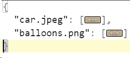
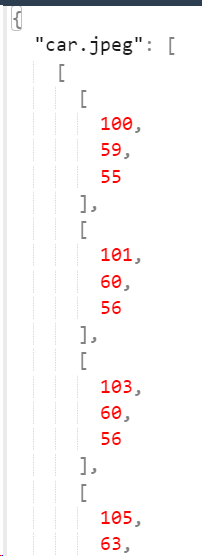
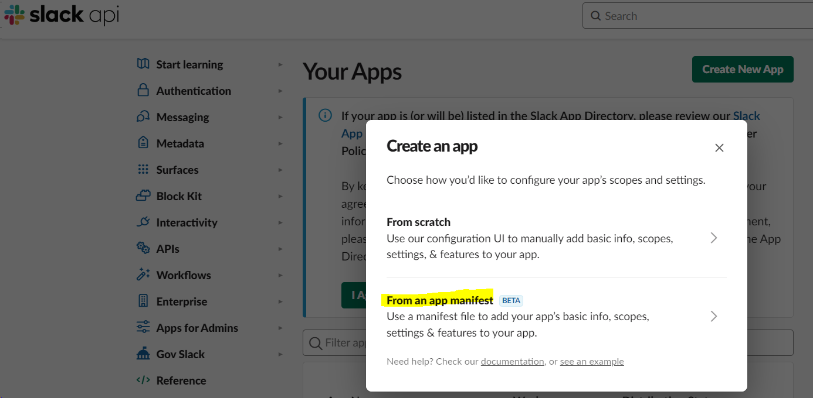

# ImageSteganography

## Intro
Image steganography is a technique of hiding information within an image.\
The process involves embedding secret data within the image in such a way that it is not easily detectable to an observer.\
The goal is to hide the existence of the information by making it appear as if the image is unchanged.

The most common technique is called LSB (Least Significant Bit) steganography.\
In this method, the information is hidden by replacing the least significant bit of each pixel in the image with a bit of the secret data.

## Description
This project allows to encode and decode secret messages into and from images.

### Demo
[Demo] (https://ilya-livshits.slab.com/posts/image-steganogaphy-demo-q2zgbryt)

## The Slack Bot
   #### How to send an encrypt message inside an image.

  * To encrypt a secret message into an image, send a Slack message. The message should follow these rules:
    * The message should be sent only in the Slack channel ID of which should be set in config.yaml file.
    * The message should begin with mentioning the bot and then the message to encrypt.
    * One image should be attached.
    * After the message will be sent, the image will be encrypted with the hidden message and stored.
  
  #### How to decipher a message from an image.
  * To decipher images that are stored, use the Slack slash-command. In the command specify the names of the images:
  `/decipher <image_name_1> <image_name_2>...<<image_name_N>`

### Requirements
* A Linux Ubuntu Host Machine
* For the slack bot:
  * SLACK_APP_TOKEN
  * SLACK_BOT_TOKEN
  * BOT_ID
  * SLACK_CHANNEL_ID
  * app_manifest.yaml file - Stored all the configurations of the bot, used to create the bot.
* For the application:
  * A makenvfile  - will store the following Environment variables:
    1. SLACK_APP_TOKEN=<APP_TOKEN>
    2. SLACK_BOT_TOKEN=<BOT_TOKEN>
    3. BOT_ID=<BOT_ID>
  * An empty user_images.json file - will be mounted to the docker and will store the encrypted images. 
  The format of each entry: `{<name_of_the_image>:<image-a 3D array represents the image in RGB color>}`
  * Pretty user_images.json example\
  \
  

### How to install
1. Install the Slack Bot:
   1. Create a Slack account.
   2. Create a workspace in Slack.
   3. Follow [this guide to create a Slack application](https://api.slack.com/authentication/basics#start).
      * The Slack app should be created from a manifest file 
      * app_manifest.yaml  - Is the manifest file should be using, it is located at the top level of the project /app/app_manifest.yaml
      * The app should be installed to the Workspace.
   4. Get from the Slack App setting keep:
      * SLACK_APP_TOKEN
      * SLACK_BOT_TOKEN
      * BOT_ID
      * CHANNEL_ID - The ID of the dedicated Slack channel where enciphered messages may be sent or received
   5. Update the CHANNEL_ID inside the /app/config/config.yaml file
2. Install the application:
   1. Create a makenvfile should contain the following Environment variables:
      1. SLACK_APP_TOKEN=<APP_TOKEN>
      2. SLACK_BOT_TOKEN=<BOT_TOKEN>
      3. BOT_ID=<BOT_ID>
   2. Create an empty user_images.json - will be mounted to the volume and will store records about the images.
   3. Open the Terminal.
   4. `docker pull ilya1200/image_steganography:v1.0.0`
   5. `docker run --name <CUSTOM_NAME_FOR_THE_CONTAINER> -p 3000:3000 --env-file <PATH_TO_makenvfile> -v <PATH_TO_user_images.json>:/app/ImageSteganographyServer/storage/user_images.json -d ilya1200/image_steganography:v1.0.0`
